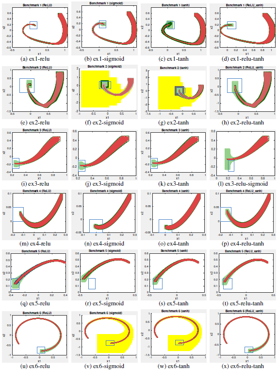
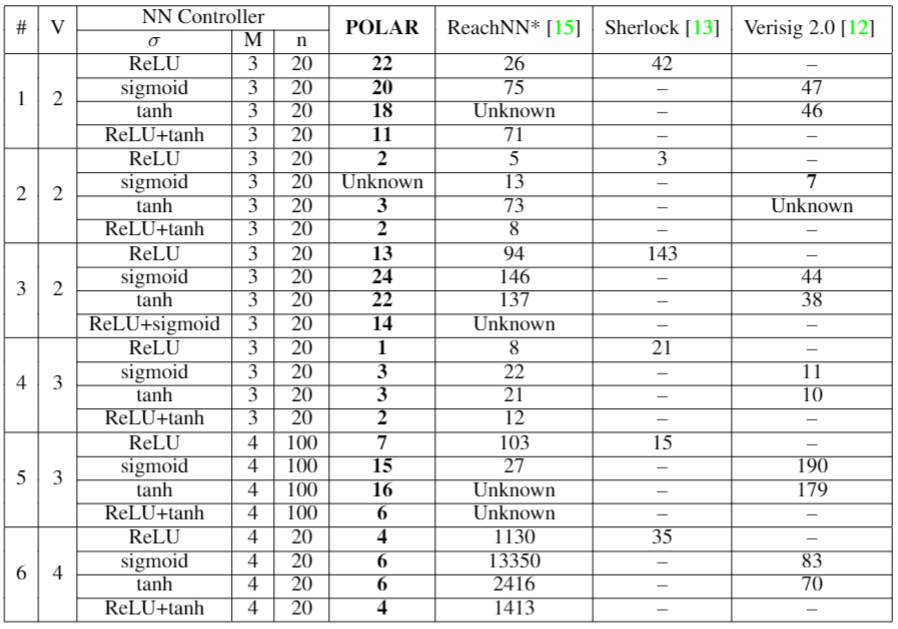

# POLAR prototype
POLAR [1] is a reachability analysis framework for neural-network controlled systems (NNCSs) based on polynomial arithmetic. Compared with existing arithmetic approaches that use standard Taylor models, our framework uses a novel approach to iteratively overapproximate the neuron output ranges layer-by-layer with a combination of Bernstein polynomial interpolation for continuous activation functions and Taylor model arithmetic for the other operations. This approach can overcome the main drawback in the standard Taylor model arithmetic, i.e. its inability to handle functions that cannot be well approximated by Taylor polynomials, and significantly improve the accuracy and efficiency of reachable states computation for NNCSs. To further tighten the overapproximation, our method keeps the Taylor model remainders symbolic under the linear mappings when estimating the output range of a neural network. 

Experiment results across a suite of benchmarks show that POLAR significantly outperforms the state-of-the-art techniques on both efficiency and tightness of reachable set estimation.

## Installation

#### System Requirements
Ubuntu 18.04, MATLAB 2016a or later

#### Up-to-date Installation
- Install dependencies through apt-get install
```
sudo apt-get install m4 libgmp3-dev libmpfr-dev libmpfr-doc libgsl-dev gsl-bin bison flex gnuplot-x11 libglpk-dev gcc-8 g++-8 libopenmpi-dev
```

#### Compile POLAR

```

./compile.sh # under the root directory ./

```

## Examples - POLAR results

### Running example
./run_motivating.sh

### Attitude control
./run_attitude_control.sh

### Example #1 to #6
./run.sh

### Checking Result
All results will be stored in ./outputs/

For SYSTEM, the results include a txt file that show the verification result and the POLAR running time, and a M file (with .m extension) that is used to plot the reachable sets computed by POLAR. One can check the result of SYSTEM by following commands.


```

vim SYSTEM_0.txt # verification result

```


```

SYSTEM_0.m # plotted reachable sets. Run the command in MATLAB.

```

## Comparison with state-of-the-arts

The following results show that our approach significantly outperforms the state-of-the-arts on both efficiency and tightness of reachable set estimation.

<p align="center">
     
</p>
<p align="left">	
    Figure 1: Reachability analysis results. We can see that except for ex2-sigmoid, POLAR produces the tightest reachable set estimation (dark green sets) and successfully proves or disproves the reachability property for all the examples. This is in comparison with other state-of-the-art tools including ReachNN* [2, 3] (light green sets), Sherlock [4] (blue sets), Verisig 2.0 [5] (grey sets), and NNV [6] (yellow sets).
</p>

<p align="center">
    
</p>
<p align="left">
    Table 1: V: number of state variables, $sigma$: activation functions, M: number of hidden layers, n: number of neurons in each hidden layer. For each approach (POLAR, ReachNN*, Sherlock, Verisig 2.0), we give the runtime in seconds if it successfully verifies the property. `Unknown': the property could not be verified. `--': the approach cannot be applied due to the type of $sigma$. We can see that POLAR finishes all cases within seconds, and achieves the best performance among all the tools simultaneously. In addition, POLAR scales better with the size of the neural network controller compared to ReachNN* and Verisig 2.0.
</p>


## Contributors
[Chao Huang](https://chaohuang2018.github.io/main/), [Jiameng Fan](https://www.jiamengf.com), [Xin Chen](https://udayton.edu/directory/artssciences/computerscience/chen-xin.php), [Wenchao Li](http://sites.bu.edu/depend/people/), [Qi Zhu](http://users.eecs.northwestern.edu/~qzhu/)

## References
[1] C.Huang, J.Fan, W.Li, X.Chen, and Q.Zhu.
[POLAR: A Polynomial Arithmetic Framework for Verifying Neural-Network Controlled Systems]()

[2] C.Huang, J.Fan, W.Li, X.Chen, and Q.Zhu.
[ReachNN: Reachability Analysis of Neural-Network Controlled Systems](https://dl.acm.org/citation.cfm?id=3358228).
ACM Transactions on Embedded Computing Systems (TECS), 18:1–22, October 2019.

[3] J.Fan, C.Huang, X.Chen, W.Li, and Q.Zhu.
[ReachNN*: A Tool for Reachability Analysis ofNeural-Network Controlled Systems](https://github.com/JmfanBU/ReachNNStar).
The 18th International Symposium on Automated Technology for Verification and Analysis (ATVA), October 2020.

[4] S.Dutta, X.Chen, and S.Sankaranarayanan.
[Reachability analysis for neural feedback systems using regressive polynomial rule inference](https://dl.acm.org/doi/10.1145/3302504.3311807). The 22nd ACM International Conference on Hybrid Systems: Computation and Control, April 2019.

[5] R.Ivanov, T.J. Carpenter, J.Weimer, R.Alur, G.J. Pappas, and I.Lee.
[Verisig 2.0: Verification of neural network controllers using taylor model preconditioning]. The 33rd International Conference on Computer-Aided Verification, July 2021 (To appear).

[6] H.Tran, X.Yang, D.M.Lopez, P.Musau, L.V.Nguyen, W.Xiang, S.Bak, and T.T.Johnson.
[NNV: the neural network verification tool for deep neural networks and learning-enabled cyber-physical systems](https://link.springer.com/chapter/10.1007/978-3-030-53288-8_1). The 32nd International Conference on Computer-Aided Verification, July 2020.


